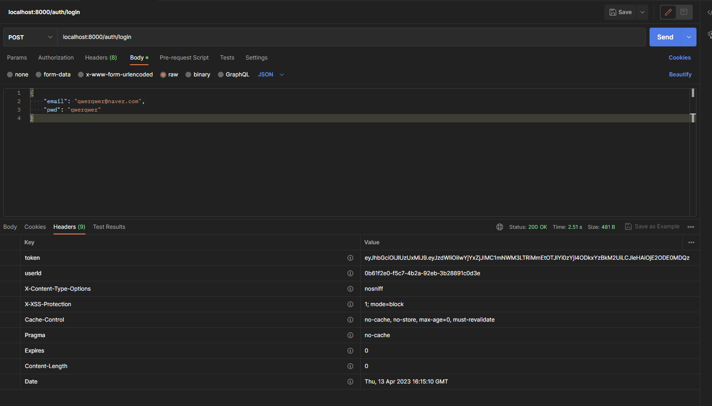
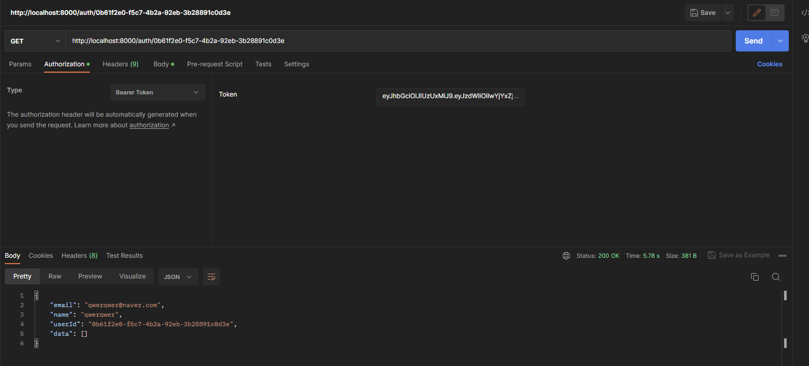

# Description
- AMD 프로젝트에서 인증 토큰을 발급하는 서비스입니다.
- 인증 토큰으로 `JWT Token`을 사용하며 `Bearer Type`를 사용합니다. 
- 현재 구현된 기능은 다음과 같습니다.

1. 회원가입
> 
2. 로그인
>   
> 위를 보면 로그인하게 되면 `token`과 `userId`가 헤더에 담겨 전송됩니다.

3. 인가된 사용자 접속
> 
> `Barer Token`을 담아 전송하면 API가 호출되는걸 확인할 수 있습니다.

4. 회원 조회
> 

# Information
- Port : 9000
- url : localhost:9000/signup (회원가입)
- url : localhost:9000/login (로그인)
- url : localhost:9000/{userId} (회원 조회)
- url : localhost:9000/health_check (health_check)

# 추후 해야 할것들
> 토큰 재발급(reissue)
> 로그아웃(logout)
> 예외처리
> Swagger Information